# Figma Design Token Eggstractor

## Summary

We traverse the Figma page, get all the variables. We then use those variables and process the nodes to create style tokens. With the style and variable tokens we use this to transform into CSS/SASS.

There are 2 types of output:

Templated (default) - Each mixin/classname/tailwind utility contains all the styles for a component of a component set. The naming/selector contains all of the required variants for that component.

Combinatorial - Each mixin/classname/tailwind utility contains partial styles for components of a component set. The naming/selector contains only the subset of the required variants for that component related to those styles.

## System Flow

### 0. Directory and Definition of Terms

There are two JavaScript environments involved in Eggstractor: the Figma client application that displays the Figma page and the Eggstractor Figma plugin. These two environments have their own JavaScript context:

The Eggstractor Figma plugin environment has a reference to a window or document to update the plugin's UI.

The Figma client application environment has a reference to the global Figma instance that allows access to the Figma API to access Figma nodes.

`src/code.ts` - Code that bootstraps the UI for the Figma plugin.

`src/ui.ts` - Code that handles communication from the Figma client application to the eggstractor Figma plugin.

`src/processors` - Code that converts a Figma node to a variable or style token. Style tokens will be used to generate CSS/SCSS using the Templated algorithm (default) or Combinatorial.

- Variable Token - Contains metadata based on Figma variable names, which are used to name SCSS variables, CSS custom properties, and other named values related to a CSS style.

- Style Token - Contains metadata based on Figma nodes that relate to styles of a component. These are used to create CSS properties and values.

`src/services/collection.service.ts` - Code that collects Figma nodes from the client side and uses processors to parse them into variable and style tokens.

`src/transformers` - Code that uses variable and style tokens to generate CSS/SCSS files that are specific to CSS/SCSS/Tailwind v3/Tailwind v4.

`src/transformers/tailwind/generators.ts` - Exclusive to tailwind transformers. used to generate variable and style token metadata to style values or Tailwind class names.

`src/transformers/variants-middleware.ts` - Code that converts the collection of Templated style tokens to style tokens that will generate Combinatorial output.



### 1. Node Traversal (`collection.service.ts`)

```typescript
// Starting from Figma's current page
const nodes = figma.currentPage;

// Process each node to extract styles and variables
for (const node of nodes) {
  // Get applicable processors for this node type
  const processors = getProcessorsForNode(node);
  // Process node to extract tokens
  const tokens = await processNode(node, processors);
}
```

### 2. Token Collection

The system collects two types of data:

1. **Style Tokens**: Direct CSS properties from nodes
2. **Variables**: Reusable design tokens (colors, typography, etc.)

#### Style Token Example:

```json
{
  "type": "style",
  "node": "TEXT",
  "properties": {
    "font-family": "Inter",
    "font-size": "16px",
    "justify-content": "flex-end"
  }
}
```

#### Variable Token Example:

```json
{
  "type": "variable",
  "path": ["background-solid-alpha-variable-style"],
  "property": "fills",
  "name": "teal-800-50",
  "value": "$teal-800-50",
  "rawValue": "rgba(0, 70, 74, 0.5)",
  "metadata": {
    "figmaId": "104:9",
    "variableId": "VariableID:5:22",
    "variableName": "teal-800-50"
  }
}
```

### 3. Processing Pipeline

We return a list of processors for each type of node. We then pass the node and accumulated variables so that we can build up the appropriate tokens.

#### Node Type Detection

```typescript
export function getProcessorsForNode(node: SceneNode): StyleProcessor[] {
  switch (node.type) {
    case 'TEXT':
      return [...fontProcessors, ...textAlignProcessors];
    case 'FRAME':
      return [backgroundProcessor, ...layoutProcessors, ...borderProcessors];
  }
}
```

#### Property Processing

Each processor:

1. Receives a node & variables
2. Extracts specific properties
3. Returns ProcessedValue or null

```typescript
interface ProcessedValue {
  value: string; // CSS/Variable value
  rawValue: string; // Original Figma value
}

interface StyleProcessor {
  property: string;
  bindingKey?: string;
  process: (
    variableTokenMapByProperty: Map<string, VariableToken>,
    node: SceneNode,
  ) => Promise<ProcessedValue | null>;
}
```

### 4. CSS Generation

We have a transformer for CSS and SASS (css being used for development output currently and not available in production mode).
This takes the tokens and then transforms the data into the appropriate format.

#### Class Generation

- Variables are referenced where available

```css
/* Example Output */
.frame {
  display: flex;
  flex-direction: column;
  justify-content: center;
}

.text {
  color: red;
  font-family: Inter;
  font-size: 16px;
}
```

## Processor Types

### Layout Processor

Converts Figma Auto Layout to CSS Flexbox:

- `layoutMode` → `flex-direction`
- `primaryAxisAlignItems` → `justify-content`
- `counterAxisAlignItems` → `align-items`

### Font Processor

Handles text styling and layout:

- Typography: font-family, size, weight
- Text alignment: vertical and horizontal
- Layout properties for text nodes

### Background Processor

Processes fills and colors:

- Solid & gradient colors
- Opacity
- Color variables

## Testing

### Test Structure

```
src/tests/
├── __snapshots__/
│   └── text-processors.test.ts.snap
├── fixtures/
│   └── figma-test-data-alignment.json
└── text-processors.test.ts
```

### Test Examples

```typescript
// text-processors.test.ts
describe('Text Processor', () => {
  it('processes text alignment', async () => {
    const node = loadTestData('alignment');
    const result = await processNode(node);
    expect(result).toMatchSnapshot();
  });
});
```
