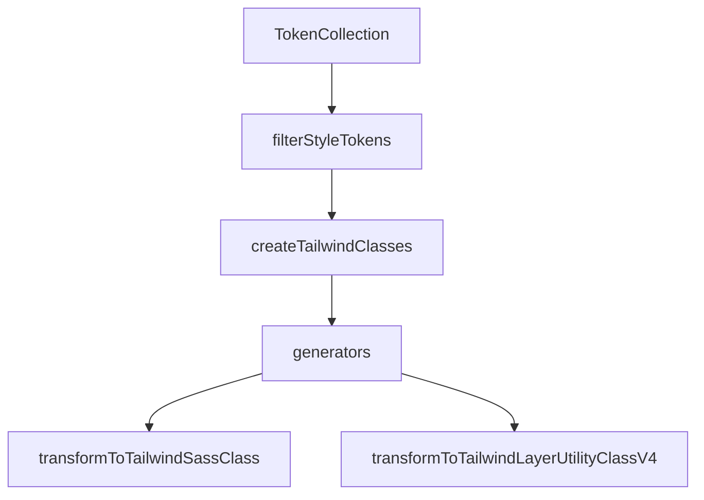

<!--@@joggrdoc@@-->
<!-- @joggr:version(v2):end -->
<!-- @joggr:warning:start -->
<!-- 
  _   _   _    __        __     _      ____    _   _   ___   _   _    ____     _   _   _ 
 | | | | | |   \ \      / /    / \    |  _ \  | \ | | |_ _| | \ | |  / ___|   | | | | | |
 | | | | | |    \ \ /\ / /    / _ \   | |_) | |  \| |  | |  |  \| | | |  _    | | | | | |
 |_| |_| |_|     \ V  V /    / ___ \  |  _ <  | |\  |  | |  | |\  | | |_| |   |_| |_| |_|
 (_) (_) (_)      \_/\_/    /_/   \_\ |_| \_\ |_| \_| |___| |_| \_|  \____|   (_) (_) (_)
                                                              
This document is managed by Joggr. Editing this document could break Joggr's core features, i.e. our 
ability to auto-maintain this document. Please use the Joggr editor to edit this document 
(link at bottom of the page).
-->
<!-- @joggr:warning:end -->
## Introduction

The Tailwind transformer modules in the `eggstractor` project are responsible for converting design tokens into Tailwind-compatible CSS classes, facilitating the integration of design systems with Tailwind CSS. The main files involved are:

* `generators.ts`: Contains logic for mapping style tokens to Tailwind class names.

* `filters.ts`: Provides utilities to filter and validate style tokens.

* `index.ts`: Orchestrates the transformation process, grouping tokens and generating the final output.

These modules work together to automate the translation of design tokens into maintainable, scalable Tailwind utility classes or SCSS mixins.

## How to Add a New Transformer

To add a new transformer (for example, to support a new CSS property or a custom Tailwind utility):

1. **Define a Generator Function**

   * In `generators.ts`, create a new function that implements the `Generator` interface (takes a `NonNullableStyleToken` and returns a Tailwind class string)

   <!-- @joggr:snippet(19b34500-3abf-4fbd-ac70-f7ebf65b6e18):start -->
   ```typescript
   type Generator = (token: NonNullableStyleToken) => string;
   ```
   <!-- @joggr:snippet(19b34500-3abf-4fbd-ac70-f7ebf65b6e18):end -->

   ```typescript
   export const generateTailwindBoxShadowClass: Generator = ({ rawValue }) => {
     // Custom logic for box-shadow
     return `shadow-[${rawValue}]`;
   };
   ```

2. **Register the Generator**

   * Add your generator to the `tailwindClassGenerators` map in `generators.ts`:

     ```typescript
     const tailwindClassGenerators: Record<string, Generator> = {
       ...
       'box-shadow': generateTailwindBoxShadowClass,
     };
     ```

3. **Ensure Token Filtering**

   * If your new property requires special filtering, update `filters.ts` accordingly.

4. **Test the Integration**

   * Use or extend the transformation functions in `index.ts` to verify that your new transformer is invoked and outputs the expected classes.

## API Documentation

### `generators.ts`

* **normalizeFourSides(value: string): \[string, string, string, string]**

  * Normalizes CSS shorthand for four-sided properties (e.g., padding, margin).

* **normalizeTwoSides(value: string): \[string, string]**

  * Normalizes CSS shorthand for two-sided properties (e.g., gap).

* **normalizeBorderRadius(value: string): \[string, string, string, string]**

  * Normalizes border-radius shorthand.

* **normalizeTailwindToken(themeMapping, value): string**

  * Maps a value to a Tailwind token or returns a bracketed value for custom tokens.

* **generateTailwindPaddingClass(token: NonNullableStyleToken): string**

  * Generates Tailwind padding classes from a token.

* **generateTailwindGapClass(token: NonNullableStyleToken): string**

  * Generates Tailwind gap classes from a token.

* **generateTailwindBorderRadiusClass(token: NonNullableStyleToken): string**

  * Generates Tailwind border-radius classes from a token.

* **generateTailwindBorderClass(token: NonNullableStyleToken): string**

  * Generates Tailwind border classes from a token.

* **generateTailwindFontFamilyOutput(token: NonNullableStyleToken): string**

  * Generates Tailwind font-family classes from a token.

* **createTailwindClasses(tokens: NonNullableStyleToken\[]): string\[]**

  * Applies all registered generators to a list of tokens and returns the resulting classes.

### `filters.ts`

* **filterStyleTokens(collection: TokenCollection): NonNullableStyleToken\[]**

  * Filters out invalid or non-style tokens from a collection.

### `index.ts`

* **transformToTailwindSassClass(collection: TokenCollection): { result: string, warnings: any\[], errors: any\[] }**

  * Converts a token collection into SCSS mixins using Tailwind classes.

* **transformToTailwindLayerUtilityClassV4(collection: TokenCollection): { result: string, warnings: any\[], errors: any\[] }**

  * Converts a token collection into Tailwind utility classes within a `@layer utilities` block.

## Relationships and Flow



* The process starts with a `TokenCollection`.

* `filterStyleTokens` extracts valid style tokens.

* `createTailwindClasses` uses the generators to map tokens to Tailwind classes.

* The transformation functions in `index.ts` format the output as SCSS mixins or utility classes.

## References

* [Eggstractor Repository](https://github.com/bitovi/eggstractor)

* [Tailwind CSS Documentation](https://tailwindcss.com/docs/utility-first)

<!-- @joggr:editLink(d8f10864-e88b-43d1-84a2-e03bc7db9ddf):start -->
---
<a href="https://app.joggr.io/app/documents/d8f10864-e88b-43d1-84a2-e03bc7db9ddf/edit">
  
</a>
<!-- @joggr:editLink(d8f10864-e88b-43d1-84a2-e03bc7db9ddf):end -->
